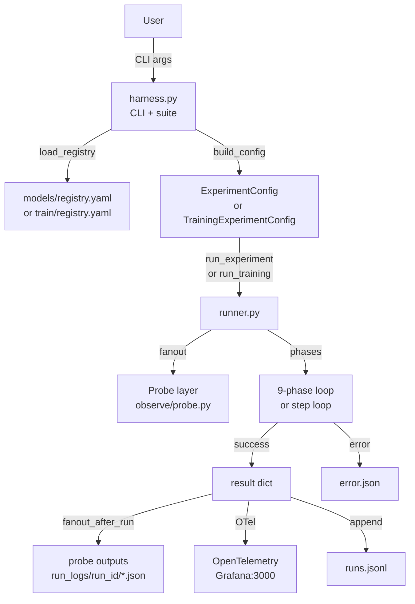

# Architecture

Generated: 2026-05-16 — confirmed from source code inspection.

## High-level purpose

TPU/GPU inference and training benchmark. Two code paths:
- **Inference benchmark** (`benchmarks/runner.py`): 9-phase latency/throughput measurements using JAX+XLA (Path 1)
- **Training benchmark** (`train/runner.py`): per-step training metrics with optimizer + loss tracking (Stage 1.6+)

A pluggable **probe layer** (`observe/probe.py`) lets observability modules (timers, memory trackers, profilers, OTel exporters) hook into the runner lifecycle without modifying runner code.

## Main components

| Component | Files | Purpose |
|---|---|---|
| Inference harness | `benchmarks/harness.py` | CLI entry, suite orchestration, JSONL writer |
| Inference runner | `benchmarks/runner.py` | 9-phase experiment loop |
| Training harness | `train/harness.py` | Training CLI (Stage 1.6+) |
| Training runner | `train/runner.py` | Per-step training loop with eval and checkpointing |
| Probe base | `observe/probe.py` | Probe ABC, registry, fanout helpers |
| Model registry | `models/registry.yaml` | 5 Stage 1 inference models |
| Training registry | `train/registry.yaml` | Training task configs |
| OTel init | `observe/otel.py` | OpenTelemetry providers; 3 modes: off/otlp/file |
| Stats | `observe/stats.py` | p50/p95/p99, MAD outlier removal, CV check |
| Lineage | `observe/lineage.py` | Git SHA + JAX version + HF revision capture |
| Compile controller | `observe/compile_controller.py` | XLA cache clear, cold+warm compile timing |
| Grafana stack | `infra/docker-compose.yml` | Local OTel + Grafana for visualization |

## Data flow — inference benchmark

```
User → CLI (harness.py)
  → load_registry() → models/registry.yaml
  → filter/build → ExperimentConfig per model×precision
  → run_experiment(config)
      → fanout_before_run() [probes]
      → phase("preflight")   → jax.local_devices()
      → phase("model_load")  → FlaxAutoModel from HuggingFace
      → phase("compile")     → cold + warm XLA JIT
      → phase("warmup")      → 20 discard passes
      → phase("latency")     → 3×100 passes @ bs=1 → p50/p95/p99
      → phase("throughput")  → 3×100 passes @ bs=32 → samples/sec
      → phase("postflight")  → device alive check
      → fanout_after_run() [probes write <name>.json]
      → OTel metrics export (if enabled)
  → append result to results/runs.jsonl
```

## Data flow — training benchmark

```
User → CLI (train/harness.py)
  → load_registry() → train/registry.yaml
  → build_config() → TrainingExperimentConfig
  → run_training(config)
      → phase("preflight", "data_load", "model_load", "compile", "warmup")
      → phase("train_loop")
          → for step in range(n_steps):
              → fanout_before_step(step)
              → loss, new_state = train_step(state, batch)
              → fanout_after_step(step, {loss, lr, grad_norm})
      → phase("eval") → eval_loss, accuracy
      → phase("checkpoint") → optional .npz save
      → phase("postflight")
      → fanout_after_run()
  → append result to results/training_runs.jsonl
```

## Control flow — single run

1. Generate unique `run_id` (UUID)
2. Capture lineage (git SHA, JAX version, HF revision) BEFORE model load
3. `fanout_before_run()` — probes prepare state, create log dir
4. OTel init (no-op unless `TPU_BENCH_OTEL` env set)
5. For each phase (wrapped in `phase()` context manager):
   - `fanout_before_phase(name)`
   - Execute phase body
   - On success: record duration, `fanout_after_phase(name, duration_s)`
   - On failure: classify error → BenchmarkError → `fanout_on_error(name, exc)` → re-raise
6. Assemble result dict (identity + lineage + metrics + flags + cost)
7. `fanout_after_run(run_id, result, log_dir)` → each probe writes `<name>.json`
8. OTel metric export
9. Return result dict or propagate BenchmarkError

## Probe lifecycle

The `Probe` ABC (`observe/probe.py`) defines up to 10 hooks (all no-op by default):

**Inference hooks:** `before_run`, `before_phase`, `after_phase`, `on_error`, `after_run`, `write_log`
**Training-only hooks:** `before_step`, `after_step`, `record_metric`

Exception safety: every hook is wrapped in `_safe_call()` — a failing probe never kills the benchmark.

Registration:
```python
from observe.probe import register_probe, set_active_probes
register_probe(TimingProbe())         # add to existing list
set_active_probes([TimingProbe()])    # replace all (used in tests)
```

## Probe inventory (all confirmed from source)

| Probe | File | Inference | Training | Optional dep |
|---|---|---|---|---|
| TimingProbe | observe/timing_probe.py | ✅ | — | — |
| MemoryProbe | observe/memory_probe.py | ✅ | — | psutil |
| InputFingerprintProbe | observe/input_fingerprint.py | ✅ | — | numpy |
| HloDumpProbe | observe/hlo_dump_probe.py | ✅ | — | — |
| JaxProfilerProbe | observe/jax_profiler_probe.py | ✅ | — | jax.profiler |
| CloudMonitoringProbe | observe/cloud_monitoring_probe.py | ✅ | — | google-cloud-monitoring |
| OTelProbe | observe/otel_probe.py | ✅ | — | opentelemetry-sdk |
| TrainingMetricsProbe | observe/training_metrics_probe.py | — | ✅ | — |
| StepTimingProbe | observe/step_timing_probe.py | — | ✅ | — |
| CheckpointProbe | observe/checkpoint_probe.py | — | ✅ | — |
| DeterminismProbe | observe/determinism_probe.py | ✅ | ✅ | — |
| DeviceInfoProbe | observe/device_info_probe.py | ✅ | ✅ | psutil, jax |
| PowerThermalProbe | observe/power_thermal_probe.py | ✅ | ✅ | psutil, nvidia-smi |
| XlaCompileProbe | observe/xla_compile_probe.py | ✅ | ✅ | JAX config |

## External dependencies

- **JAX + Flax + Optax + Orbax**: Core ML runtime and training
- **HuggingFace Transformers** (pinned `>=4.40,<4.45`): Model loading via FlaxAuto*
- **PyYAML**: Registry parsing
- **OpenTelemetry** (optional): Tracer/meter providers, OTLP gRPC export
- **otel-lgtm** (Docker): Grafana + Tempo + Prometheus local stack
- **pytest**: Tests only

## Configuration model

### ExperimentConfig (inference, benchmarks/runner.py)
Key fields: model_id, hf_id, task, domain, architecture_family, precision, device, framework, seq_len, batch_size_latency, batch_size_throughput, input_seed, device_cost_usd_per_hr

### TrainingExperimentConfig (train/runner.py)
Key fields: task_id, hf_id, task, optimizer, lr_schedule, max_grad_norm, grad_accum_steps, num_steps, num_eval_steps, input_seed, eval_seed, deterministic, save_checkpoint

### Environment variables
| Variable | Default | Effect |
|---|---|---|
| `TPU_BENCH_OTEL` | off | OTel mode: off \| otlp \| file |
| `TPU_BENCH_OTEL_ENDPOINT` | localhost:4317 | OTLP gRPC endpoint |
| `TPU_BENCH_OTEL_DIR` | results/otel/ | OTLP-JSON output dir (file mode) |
| `JAX_PLATFORMS` | (JAX default) | Override JAX device: cpu \| tpu \| gpu |
| `HF_TOKEN` | — | HuggingFace token for gated models |
| `XLA_FLAGS` | — | Set by HloDumpProbe for HLO text dumps |

## Error handling model

All phase exceptions are caught, classified, and wrapped as `BenchmarkError(phase, original, category)`:
- `gated_model` — model requires HF license acceptance
- `network` — download failure
- `compile_error` — XLA compilation failure
- `oom` — out of memory
- `interrupted` — KeyboardInterrupt
- `other` — unclassified

Failure writes `results/run_logs/<run_id>/error.json`. Probes receive `on_error()` before re-raise.

## Observability model

Three levels:
1. **Structured results** (always): `results/runs.jsonl` (one JSON/experiment), `results/run_logs/<run_id>/lineage.json`
2. **Probe outputs** (pluggable): `results/run_logs/<run_id>/<probe_name>.json`
3. **OpenTelemetry** (opt-in): spans + metrics → OTLP gRPC or OTLP-JSON files → Grafana

## Security model

- No real data: all inputs are synthetically generated from seeds
- No secrets in code: all credentials via env vars or gcloud auth
- HF gated model access: user must accept license on HuggingFace; harness fails cleanly if token missing

## Extension points

- **New probe**: implement `Probe` ABC, register via `register_probe()`
- **New model**: add entry to `models/registry.yaml` with task, input_spec, architecture fields
- **New suite**: add entry to `SUITES` dict in `benchmarks/harness.py`
- **New execution path**: add framework handling in `benchmarks/runner.py` _load_flax_model() and _build_forward_fn()

## Known limitations

1. **Inference only (Stage 1)**: No multi-host, no distributed inference
2. **Path 1 only (Stage 1)**: JAX + Flax. No PyTorch, TensorRT, or torch_xla paths
3. **Phases 6–8 not implemented**: Profiler (Stage 3), memory sweep (Stage 3), numerics (Stage 6)
4. **Probe ordering not guaranteed**: Sequential fanout, no dependency graph
5. **Python binary**: Makefile uses `python` not `python3` — breaks on systems without alias
6. **OTel eager import bug**: get_tracer()/get_meter() in otel.py import opentelemetry even when disabled

## Mermaid diagram


